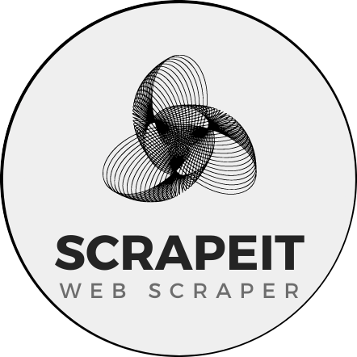

<h1 align="center">ScrapeIt - Web Scraper App</h1>
<div align="center"></div>
<div align="center">ScrapeIt is a web scraper app that allows you to extract text or HTML content from web pages by providing a URL.</div>


## Tech Stack

- **React:**  Frontend framework for building user interfaces
- **Auth0:**  Authentication and authorization management
- **Axios:**  HTTP client for making API requests
- **Tailwind:** For styling the components
- **DOMPurify:** Library for sanitizing and preventing XSS vulnerabilities
- **html2pdf.js:** Library for generating PDFs from HTML content
- **API Ninjas:** Third-party API used for web scraping

## Getting Started

### Prerequisite

- Node.js (https://nodejs.org/) installed on your machine.

### Installation

1. Clone the repository:
```bash
git clone https://github.com/MisterMickey/ScrapeIt.git
cd ScrapeIt
```
   
2. Install dependencies:
```bash
npm install
```
3. Edit the .env file like this and add your Auth0 Credentials and API Ninjas API key in the place holders
```bash
VITE_AUTH0_DOMAIN="AUTH0_DOMAIN"
VITE_AUTH0_CLIENT_ID="AUTH0_CLIENT_ID"
VITE_AUTH0_REDIRECT_URL="http://localhost:5173"
VITE_API_NINJAS_X_API_KEY="API_NINJAS_X_API_KEY"
```
4. Start the app
```bash
npm run dev
  ```

## Features 

* Log in or log out using Auth0 authentication.
* Enter a URL to scrape and choose between extracting text or HTML content.
* Download scraped content as a PDF.

  
## Credits
API Ninjas (https://api.api-ninjas.com/): For providing the web scraping API.

## Author
* <i>Shubham Singodiya</i>

## License
This project is licensed under the MIT License.

## Support
Support the project by starring the repository.

